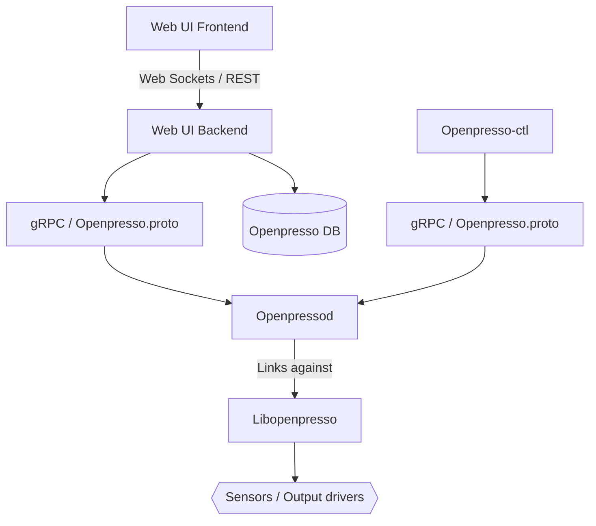

Openpresso is composed of several independent projects that together form the complete platform.

## Architecture

## Components

### Libopenpresso {#libopenpresso}

The foundation of the entire ecosystem.

Libopenpresso provides high-level abstractions for espresso machine hardware such as:

- Temperature sensor
- Pressure controller
- Solenoid valve
- Indicaton lamps and buttons

The library is intentionally made machine-agnostic and can be configured to support different hardware modules and machine architectures.

- [Repository](https://github.com/openpresso/libopenpresso)
- [Documentation](/openpresso-docs/libopenpresso)

### Openpressod {#openpressod}

The machine control daemon.

Openpressod uses Libopenpresso to interact with hardware and exposes machine functionality through gRPC over Unix or TCP sockets.

> [!NOTE]
> Current implementation configures the Libopenresso to target specific hardware modules and a machine, such as the Gaggia Classic Pro. Later it may be refactored to make it more flexible or just use as a reference point to implement another deamon.

- [Repository](https://github.com/openpresso/openpressod)
- [Documentation](/openpresso-docs/openpressod)

### Openpresso.proto {#openpresso-proto}

The shared Openpressod gRPC API definition.

This repository contains protocol definitions and generated stubs used by the daemon and client applications.

- [Repository](https://github.com/openpresso/openpresso-proto)

### Openpresso-ctl {#openpresso-ctl}

A command-line client for interacting with Openpressod.

It maps daemon gRPC API directly to CLI commands. Useful for testing or creating simple cron tasks like scheduled preheating.

- [Repository](https://github.com/openpresso/openpresso-ctl)
- [Documentation](/openpresso-docs/openpresso-ctl)

### Web Backend *(planned)* {#openpresso-backend}

REST API, database access, daemon communication.

### Web Frontend *(planned)* {#openpresso-frontend}

Dashboard, brew profile editor, history viewer, and machine control interface with
dynamic layout to be able to use on a small touchscreen attached to espresso machine
with kiosk mode browser or on any external device in the local network.

### Development Infrastructure

#### Openpresso Toolchain

A helper repository containing Docker images with a cross-compiling toolchain used to compile Openpresso components consistently across development systems.

- [Repository](https://github.com/openpresso/openpresso-toolchain)
